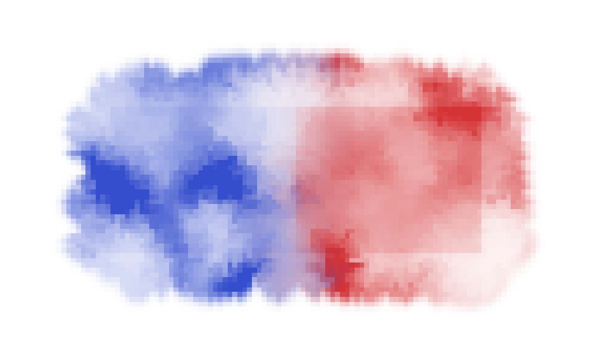

# watercolor
Implementation of Curtis et al. 1997 Computer-Generated Watercolor.

## Video demos

* Single pigment: https://youtube.com/watch?v=ic56LUOM6j0
* Two-pigment blending: https://youtube.com/watch?v=JjEhPoaxUZs
* Real-time interaction: https://youtube.com/watch?v=1ohEUe2xzrA
